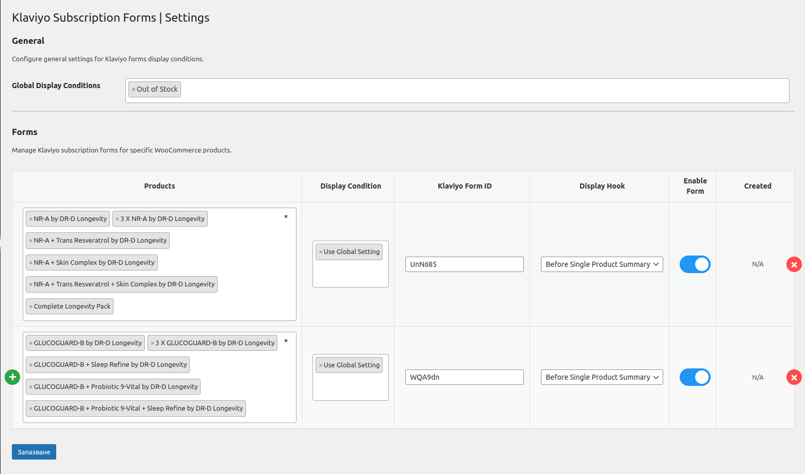

# SM - Klaviyo Subscription Forms for WooCommerce

- **Developed by:** Martin Nestorov 
    - Explore more at [nestorov.dev](https://github.com/mnestorov)
- **Plugin URI:** https://github.com/mnestorov/smarty-klaviyo-subscription-forms

## Support The Project

Your support is greatly appreciated and will help ensure all of the projects continued development and improvement. Thank you for being a part of the community!
You can send me money on Revolut by following this link: https://revolut.me/mnestorovv

## Overview

**Smarty Studio - Klaviyo Subscription Forms for WooCommerce** is a powerful plugin designed to manage and display Klaviyo subscription forms for out-of-stock products in WooCommerce. 

This plugin is fully compatible with WordPress multisite environments, allowing each site to manage its own product/form pairs independently. 

The plugin is particularly useful for eCommerce stores that want to engage customers by offering subscription options when products are out of stock.

## Features

- **Multiple Product/Form Pairs:** Easily manage multiple product/form pairs. Assign different Klaviyo forms to specific products based on their titles.
- **Dynamic Form Preview:** Preview the Klaviyo form directly within the admin settings before saving, ensuring the correct form is associated with the product.
- **Multisite Support:** Each site within a WordPress multisite network can manage its own settings independently, making it ideal for multi-brand or multi-region stores.
- **Seamless WooCommerce Integration:** The plugin integrates smoothly with WooCommerce, displaying the correct Klaviyo form on the product page when items are out of stock.
- **Admin-Friendly Interface:** An intuitive settings page within the WooCommerce menu allows for easy management of product/form associations.

## Installation

1. **Upload Plugin:**
   - Upload the plugin files to the `/wp-content/plugins/smarty-klaviyo-subscription-forms` directory, or install the plugin through the WordPress plugins screen directly.

2. **Activate Plugin:**
   - Activate the plugin through the 'Plugins' menu in WordPress. For multisite installations, you can activate the plugin network-wide or on individual sites.

3. **Configure Settings:**
   - Navigate to **WooCommerce > Klaviyo Forms** to start adding product/form pairs. Use the dynamic table to add multiple pairs and preview the forms before saving.

## Usage

1. **Adding Product/Form Pairs:**
   - In the **WooCommerce > Klaviyo Forms** settings page, you can add multiple rows where each row contains a product name and a Klaviyo form ID.
   - The plugin will automatically display the corresponding Klaviyo form on the product page if the product is out of stock.

2. **Form Preview:**
   - Use the preview feature to see how the Klaviyo form will appear on the front end, ensuring the correct form is selected.

3. **Multisite Management:**
   - If you're using WordPress multisite, each site can manage its own Klaviyo forms independently. This is particularly useful for networks where each site represents a different brand or region.

### Functions

- **smarty_add_klaviyo_form_for_out_of_stock_products:** Displays the appropriate Klaviyo form on the product page when the product is out of stock.
- **smarty_klaviyo_forms_page:** Renders the admin settings page where product/form pairs can be managed.
- **smarty_klaviyo_add_admin_menu:** Adds a submenu under WooCommerce for managing the Klaviyo forms.

## Requirements

- **WordPress 5.0 or higher**
- **WooCommerce 3.0 or higher**
- **PHP 7.0 or higher**
- **Klaviyo Account:** You'll need a Klaviyo account to create and manage your forms.

## Changelog

For a detailed list of changes and updates made to this project, please refer to our [Changelog](./CHANGELOG.md).

## Screenshots

## Contributing

Contributions are welcome. Please follow the WordPress coding standards and submit pull requests for any enhancements.

## Support The Project

If you find this script helpful and would like to support its development and maintenance, please consider the following options:

- **_Star the repository_**: If you're using this script from a GitHub repository, please give the project a star on GitHub. This helps others discover the project and shows your appreciation for the work done.

- **_Share your feedback_**: Your feedback, suggestions, and feature requests are invaluable to the project's growth. Please open issues on the GitHub repository or contact the author directly to provide your input.

- **_Contribute_**: You can contribute to the project by submitting pull requests with bug fixes, improvements, or new features. Make sure to follow the project's coding style and guidelines when making changes.

- **_Spread the word_**: Share the project with your friends, colleagues, and social media networks to help others benefit from the script as well.

- **_Donate_**: Show your appreciation with a small donation. Your support will help me maintain and enhance the script. Every little bit helps, and your donation will make a big difference in my ability to keep this project alive and thriving.

Your support is greatly appreciated and will help ensure all of the projects continued development and improvement. Thank you for being a part of the community!
You can send me money on Revolut by following this link: https://revolut.me/mnestorovv

---

## License

This project is released under the [GPL-2.0+ License](http://www.gnu.org/licenses/gpl-2.0.txt).
